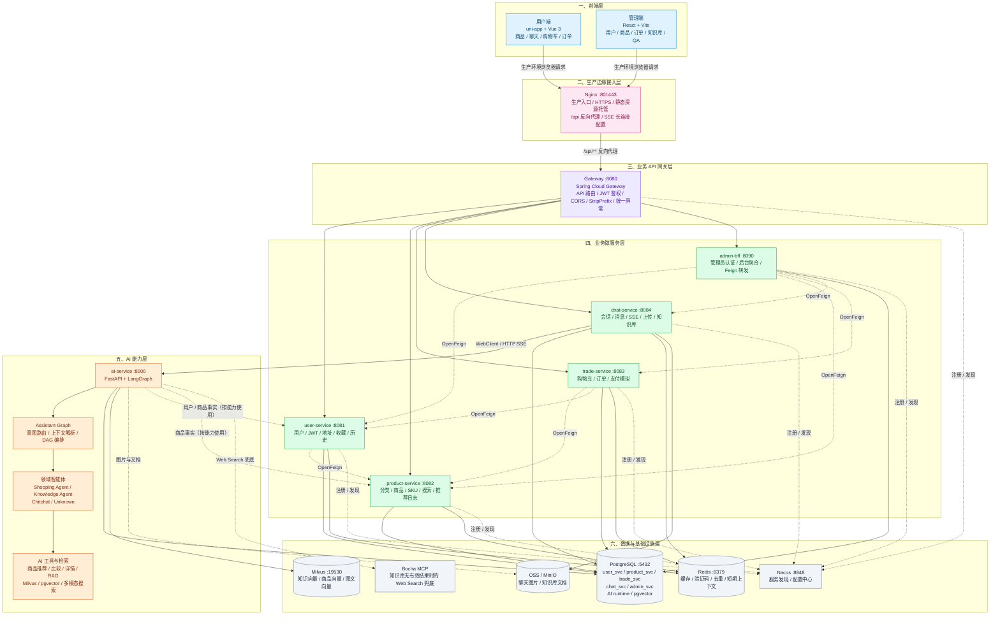
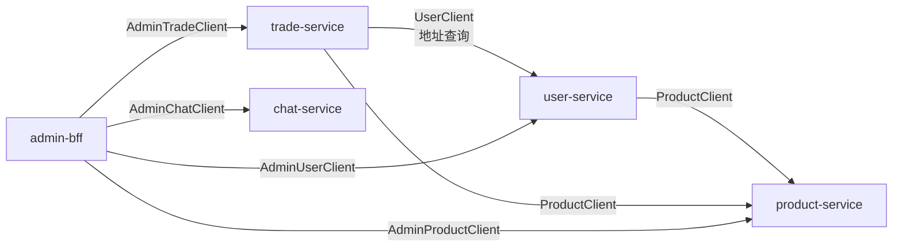
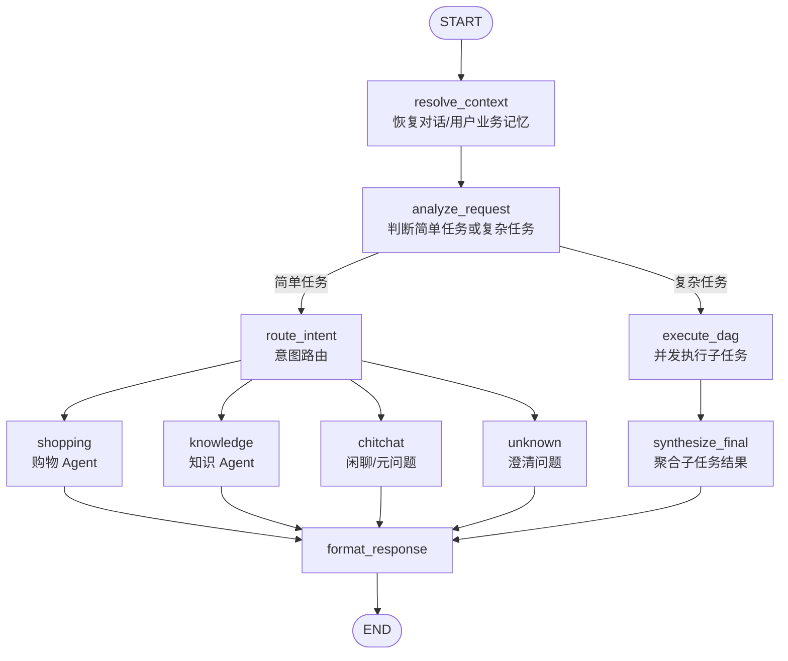

# WeLoveShop微爱商城

WeLoveShop微爱商城是一个面向电商场景的 AI Agent 商城系统。项目将传统电商能力、Java 微服务架构和 Python 智能体服务结合起来，提供商品浏览、搜索、收藏、购物车、订单、知识问答以及 AI 导购等能力。

项目的核心目标不是简单地在商城页面中嵌入一个聊天窗口，而是让 AI 能够理解用户意图，调用商品检索、知识库、用户画像和商品详情等能力，并将结果以可交互的商品卡片、对比结果和多轮对话的形式返回给用户。

当前项目由以下几部分组成：

- Java Spring Boot / Spring Cloud 微服务：负责用户、商品、交易、聊天和管理后台业务。
- Python `ai-service`：负责 Assistant Graph、购物 Agent、知识库 Agent、RAG、向量检索和多模态商品搜索。
- `web/welove-shop`：基于 uni-app + Vue 3 的用户端商城。
- `web/admin-web`：基于 React + Vite 的运营管理后台。
- 生产接入层：由 Nginx 托管前端构建产物、终止 HTTPS，并将 `/api/**` 反向代理到 Spring Cloud Gateway。
- PostgreSQL、Redis、Milvus、Nacos、对象存储等基础设施。

> 项目仍处于持续演进阶段。本文会明确区分当前已经实现的能力和未来规划中的能力。

## 目录

- [一、设计思路](#一设计思路)
- [二、整体架构](#二整体架构)
- [三、仓库结构](#三仓库结构)
- [四、Java 微服务](#四java-微服务)
- [五、微服务之间的调用](#五微服务之间的调用)
- [六、AI Service 与多智能体编排](#六ai-service-与多智能体编排)
- [七、前端应用](#七前端应用)
- [八、数据库与基础设施](#八数据库与基础设施)
- [九、关键业务链路](#九关键业务链路)
- [十、本地启动](#十本地启动)
- [十一、开发与验证](#十一开发与验证)
- [十二、未来计划](#十二未来计划)
- [十三、常见排查思路](#十三常见排查思路)

## 一、设计思路

### 1. 业务边界优先

每个微服务拥有清晰的数据和业务边界：

- 用户数据由 `user-service` 负责。
- 商品目录、SKU、评论和推荐日志由 `product-service` 负责。
- 购物车和订单由 `trade-service` 负责。
- 会话、消息、知识文档、QA 日志和 Agent 运行记录由 `chat-service` 负责。
- 管理端只通过 `admin-bff` 访问下游服务，不直接读取其他服务数据库。

这样做可以避免把所有业务逻辑重新堆积到 AI 服务或管理 BFF 中，也方便未来独立扩容和替换某个领域服务。

### 2. AI 负责理解和编排，业务服务负责事实和写操作

AI Service 可以理解用户想做什么、应该查询什么、如何组织答案，但商品价格、库存、订单状态、用户权限等业务事实不能由模型自由生成。

因此项目采用以下分工：

- AI Service：意图识别、任务拆解、商品召回、知识检索、排序、答案组织。
- Java 微服务：商品、用户、地址、购物车、订单等业务事实和持久化。
- 前端：需要用户确认的加购等交互操作，以及 SSE 流状态管理。

例如，AI 可以返回“建议购买这些商品”的商品卡片，但真正的加购动作由用户端调用 `trade-service` 完成；AI 不直接修改购物车。

### 3. 结构化协议优先于自由文本

AI 返回的不只是字符串，还包括稳定的数据结构：

- `product_cards`：商品卡片。
- `sources`：知识库或网络资料来源。
- `confirm_card`：需要用户确认的操作卡片。
- `cart_selection`：批量选择加入购物车的卡片。
- `route`、`task_type`：路由和任务类型。
- `orchestrator_mode`、`sub_results`、`task_levels`：复杂任务的编排信息。

这种设计让前端能够稳定渲染，也让后续的评测、日志分析和管理后台监控有明确的数据基础。

### 4. 外部依赖不可用时尽量降级

项目在本地开发阶段保留了多种降级策略：

- Nacos 不可用时，Java 服务可以使用本地 `application.yml` / `application-dev.yml`。
- AI Service 的 PostgreSQL runtime 初始化失败时，会降级到 LangGraph 内存 checkpointer/store。
- Milvus 检索失败时，商品侧可以尝试 pgvector 兜底；知识库侧可以尝试 Bocha Web Search。
- Java 服务调用 AI 失败时，聊天服务会返回可持久化的错误或截断状态。

生产环境仍然应该显式配置依赖和密钥，不能把开发期默认值当作生产方案。

## 二、整体架构

### 1. 系统架构图



### 2. 端口与入口

| 组件 | 默认端口 | 说明 |
| --- | ---: | --- |
| Nginx | `80/443` | 生产环境统一 Web 入口、HTTPS、静态资源和 API 反向代理 |
| Gateway | `8080` | Spring Cloud Gateway 业务 API 网关 |
| user-service | `8081` | 用户身份与用户资料 |
| product-service | `8082` | 商品目录与商品搜索 |
| trade-service | `8083` | 购物车与订单 |
| chat-service | `8084` | 会话、消息和 AI SSE 代理 |
| admin-bff | `8090` | 管理端 BFF |
| ai-service | `8000` | FastAPI AI 服务 |
| Nacos | `8848` | 服务发现和配置中心 |
| Redis | `6379` | 缓存、验证码、去重和上下文 |
| PostgreSQL | `5432` | 业务数据库和 AI runtime |
| Milvus | `19530` | 向量检索 |

### 3. Nginx 与 Spring Cloud Gateway 的关系

生产环境中，Nginx 和 Spring Cloud Gateway 不是两个重复的网关，而是处于不同层次：

```text
浏览器
  ↓ HTTPS :443
Nginx
  ├─ /              → 托管 Vue / uni-app H5 构建产物
  └─ /api/**        → 反向代理到 Spring Cloud Gateway :8080
                         ↓
              user/product/trade/chat/admin-bff
                         ↓
                     AI Service
```

职责划分如下：

- **Nginx：生产边缘入口**。负责域名接入、HTTPS 终止、前端静态资源托管、压缩、同源访问以及 `/api/**` 反向代理；SSE 场景需要关闭不合适的代理缓冲并配置足够的读取超时时间。
- **Spring Cloud Gateway：业务 API 网关**。负责显式 API 路由、Nacos 服务发现、JWT 鉴权、CORS、`StripPrefix`、统一错误处理以及后续接入 Sentinel 的网关级流量治理。
- **后端微服务：领域业务实现**。负责用户、商品、交易、聊天和管理后台业务，不直接暴露给公网。

开发环境中，Vite Dev Server 会将 `/api` 代理到 Gateway `8080`，因此本地调试可以不启动 Nginx；生产部署则以 Nginx 作为前置 Web 入口，Gateway 作为内部业务 API 入口。

### 4. 网关路径规则

网关关闭了自动 discovery locator，采用显式路由：

| 前端请求 | 目标服务 | 网关转发后的路径示例 |
| --- | --- | --- |
| `/api/user/**` | `user-service` | `/api/user/auth/profile` → `/auth/profile` |
| `/api/product/**` | `product-service` | `/api/product/product/list` → `/product/list` |
| `/api/trade/**` | `trade-service` | `/api/trade/cart/list` → `/cart/list` |
| `/api/chat/**` | `chat-service` | `/api/chat/chat/stream/messages` → `/chat/stream/messages` |
| `/api/admin/**` | `admin-bff` | `/api/admin/dashboard/stats` → `/dashboard/stats` |

网关使用 `StripPrefix=2`，所以路径中经常会同时出现网关服务前缀和 Controller 前缀。这是排查 404 时最容易忽略的地方。

## 三、仓库结构

```text
welove-shop-agt/
├─ pom.xml                         # Java Maven 聚合父工程
├─ gateway/                        # Spring Cloud Gateway
├─ common/                         # Java 公共模块
│  ├─ common-core                  # Result、异常、分页、工具类
│  ├─ common-web                   # 全局 Web 异常处理与自动配置
│  ├─ common-db                    # MyBatis Plus、基础实体、自动填充
│  ├─ common-security              # JWT、UserContext、认证拦截器
│  └─ common-storage               # OSS / 本地磁盘存储抽象
├─ services/
│  ├─ user-service/
│  ├─ product-service/
│  ├─ trade-service/
│  └─ chat-service/
├─ admin-bff/                      # 管理端聚合和转发
├─ ai-service/                     # FastAPI + LangGraph AI 服务
├─ web/
│  ├─ admin-web/                   # React/Vite 管理端
│  └─ welove-shop/                 # uni-app/Vue 用户端
├─ db/                             # 历史、辅助和跨服务 SQL
├─ infra/                          # Docker Compose、Nacos、Milvus 等
├─ docs/                           # API、设计和测试文档
└─ backend/                        # 本地数据库/对象存储持久化目录
```

各目录中的 `AGENTS.md` 是实现功能时的重要约束，应优先阅读。例如聊天功能必须同时检查 `chat-service`、`ai-service` 和用户端聊天页面；商品推荐功能必须同时检查 `product-service`、AI 商品工具和前端商品卡片。

## 四、Java 微服务

Java 服务统一采用 Spring Boot 3.2、Spring Cloud 2023、Spring Cloud Alibaba、MyBatis Plus 和 PostgreSQL。

### 1. common 公共模块

#### `common-core`

提供跨服务共享的基础类型：

- `Result<T>`：统一响应封装。
- `PageResult<T>`：分页响应。
- `BizException` / `ErrorCode`：业务异常和错误码。
- JSON、日期等基础工具。

#### `common-web`

提供统一的 Spring MVC 异常处理：

- 业务异常映射为统一错误响应。
- 参数校验、JSON 解析、缺少参数、类型不匹配等异常统一处理。
- 绝大多数业务错误通过 `Result.code` 表达，前端不能只依赖 HTTP 状态码。

#### `common-db`

提供 MyBatis Plus 自动配置、`BaseEntity` 和时间字段自动填充能力。

#### `common-security`

提供跨服务共用的 JWT 机制：

- `JwtUtil` 负责签发和解析 access/refresh token。
- `JwtInterceptor` 从 `Authorization: Bearer ...` 解析用户身份。
- `UserContext` 通过 ThreadLocal 暴露当前用户 ID、用户名、手机号和角色。
- 用户服务和其他业务服务共享 JWT 密钥，以便网关之后的服务独立校验 token。

#### `common-storage`

通过 `StorageService` 抽象文件存储，支持：

- 阿里云 OSS。
- 本地磁盘。

聊天图片和知识库文档都通过该抽象保存，业务代码不直接依赖具体存储实现。

### 2. gateway

Gateway 是唯一对前端 API 暴露的 Java HTTP 入口；生产环境由 Nginx 作为公网 Web 入口并反向代理到 Gateway。Gateway 主要职责是：

- 根据路径转发到 Nacos 中注册的服务。
- 处理 CORS。
- 统一网关错误响应。
- 预留 Sentinel 流控扩展。

网关不承载业务逻辑，也不应该在这里实现商品、订单或 AI 编排。

### 3. user-service

负责用户身份和用户侧资料：

- 手机验证码发送和登录。
- 测试账号一键登录。
- JWT 刷新和当前用户资料。
- 地址列表、添加、更新、删除、设置默认地址。
- 商品收藏。
- 浏览历史。

用户的身份全部来自 `UserContext`，Controller 不信任请求体中的 `userId`。收藏和浏览历史中的商品展示信息通过商品服务补充，避免跨库读取商品表。

### 4. product-service

负责商品目录及推荐相关数据：

- 分类列表和分类详情。
- 商品列表、详情、热门商品、搜索和批量查询。
- SKU、商品图片、FAQ、评论。
- 管理端商品新增、编辑、上下架和统计。
- 推荐曝光、点击和反馈日志。

当前搜索主要是数据库/向量服务组合逻辑，并包含关键词、同义词和排序，不应默认假设项目已经接入独立 Elasticsearch。

商品详情、分类和热门商品支持 Redis 缓存。商品主数据仍然以 PostgreSQL `product_svc` 为准。

### 5. trade-service

负责交易域：

- 购物车增删改、数量更新和 SKU 切换。
- 订单创建、列表、详情、取消。
- 模拟支付、发货、确认收货。
- 未支付订单定时取消。

订单创建时会通过 OpenFeign 调用商品服务校验商品/SKU，并通过用户服务读取收货地址。订单明细会保存商品标题、图片、SKU 属性和价格快照，保证商品后续变化不会修改历史订单。

订单状态约定：

| 状态 | 含义 |
| ---: | --- |
| `0` | 待支付 |
| `1` | 已支付 / 待发货 |
| `2` | 已发货 |
| `3` | 已完成 |
| `4` | 已取消 |

### 6. chat-service

`chat-service` 是用户端、管理端与 Python AI 服务之间的桥梁，负责：

- 会话和消息持久化。
- 普通问答和文本 SSE。
- 图文多模态 SSE。
- 聊天图片上传。
- 知识文档上传、解析和删除。
- QA 日志、未回答问题和 Agent 运行记录。
- AI 响应中的商品卡片、来源、状态和编排元数据持久化。

由于 SSE 需要长连接和事件转发，`chat-service` 调用 AI Service 使用 `WebClient`，而不是把流式请求包装成普通 OpenFeign 调用。

聊天停止生成时，前端会把已经收到的内容 POST 到 `/chat/messages/stop`；后端也会在上游连接取消时通过 `doOnCancel` 兜底。两条路径会通过截断内容和时间窗口去重，最终形成 `status=truncated` 的 assistant 消息。

### 7. admin-bff

管理端 BFF 负责两类工作：

1. 管理员登录、JWT 签发和管理员角色校验。
2. 通过 Feign 聚合下游服务，向 React 管理端提供更适合后台页面的数据结构。

目前包含仪表盘、用户、商品、订单、会话、知识库、QA、公告、Agent 运行和推荐统计等后端接口。其中部分前端页面尚未在路由中启用，但后端接口已经存在。

管理端 token 使用 `role=ADMIN` claim，与普通用户 token 分开处理。

## 五、微服务之间的调用

### 1. 为什么使用 OpenFeign

业务服务不直接读取其他服务的数据库，而是通过服务发现和 OpenFeign 调用对方的内部接口：

- 让数据所有权保持在所属服务。
- 让调用方不依赖对方数据库表结构。
- 统一使用服务名进行调用，避免硬编码服务 IP。
- 便于后续加入超时、重试、熔断和链路追踪。

### 2. 当前调用关系



典型 OpenFeign 客户端包括：

| 调用方 | 客户端 | 目标服务 | 主要用途 |
| --- | --- | --- | --- |
| `user-service` | `ProductClient` | `product-service` | 收藏/浏览历史商品信息补充 |
| `trade-service` | `ProductClient` | `product-service` | 商品和 SKU 批量校验、读取快照 |
| `trade-service` | `UserClient` | `user-service` | 地址查询 |
| `admin-bff` | `AdminUserClient` | `user-service` | 用户管理 |
| `admin-bff` | `AdminProductClient` | `product-service` | 商品、推荐统计和商品管理 |
| `admin-bff` | `AdminTradeClient` | `trade-service` | 订单管理和订单统计 |
| `admin-bff` | `AdminChatClient` | `chat-service` | 会话、知识库、QA 和 Agent 监控 |

管理接口通常使用 `/internal/admin/**`，统计接口使用 `/internal/**`，这些接口不经过网关直接暴露给前端，而是由 BFF 在服务内部调用。

### 3. OpenFeign 使用注意事项

修改跨服务接口时应同时检查：

1. 提供方 Controller 的路径和响应类型。
2. Feign Client 的 `@FeignClient` 服务名和方法映射。
3. BFF 或业务调用方的 DTO。
4. 前端 API 模块对最终响应结构的假设。
5. Nacos 中的服务名和服务是否已经注册。

## 六、AI Service 与多智能体编排

AI Service 位于 [ai-service](ai-service)，启动入口固定为 `main.py:app`。它不是 Java 微服务的替代品，而是一个独立的 AI 应用层。

### 1. 分层结构

```text
app/api/                         HTTP、Schema、SSE、错误处理
app/application/assistant/       Assistant 主图、路由和 DAG 编排
app/domain/shopping/             购物领域 Agent、能力和商品检索
app/domain/knowledge/            知识库 Agent、文档管道和 RAG
app/infrastructure/              LLM、Milvus、PG、Java API、MCP 等外部实现
app/prompts/                     购物、知识问答、闲聊和标题生成 Prompt
app/legacy/                      历史购物车和旧 Chain，不作为新功能入口
```

依赖方向应保持为：

```text
api → application → domain → infrastructure
```

HTTP 层不应直接拼 Milvus 表达式、操作数据库或实现商品业务规则。

### 2. Assistant 主图

Assistant Graph 的核心节点大致如下：



### 3. 意图路由策略

路由采用“低成本规则优先、结构化模型补充、安全澄清兜底”的策略：

1. 高置信规则：明确的商品推荐、商品比较、成分/用法知识问题、图片搜索等直接路由。
2. 结构化 LLM Router：规则无法确定时，让模型输出受约束的 `shopping`、`knowledge`、`chitchat` 或 `unknown`。
3. 低置信兜底：不强行猜测领域，而是向用户询问更明确的目标。

商品卡片记忆和知识实体记忆会参与上下文路由。例如：

- “刚才推荐的第一款多少钱？”通常路由到购物领域。
- “它的成分是什么？”在上一轮存在知识实体时可以路由到知识领域。

### 4. 领域 Agent

#### Shopping Agent

Shopping Agent 不是单一工具，而是由多个能力组成：

- `recommend`：解析购物需求、召回候选商品、排序并生成推荐卡片。
- `compare`：比较多个商品的价格、评分、销量、属性和适用场景。
- `detail`：读取商品详情、SKU、价格、库存和适用性事实。
- `user_context`：读取用户资料、收藏、浏览历史和订单相关上下文。

商品推荐的典型管道是：

```text
用户问题
  → ShoppingNeed 结构化需求
  → 类目/品牌/预算等约束
  → Milvus hybrid / dense / BM25 召回
  → DashScope rerank 精排
  → 规则排序 + 个性化软重排
  → 商品卡片与推荐理由
```

当前轮明确提出的预算、品类等约束优先级高于长期偏好；长期画像只参与软重排，避免历史偏好覆盖用户本轮真实需求。

这里需要区分“检索模式”和“一次请求中的召回通道”：当前文本商品主链路的 `hybrid` 模式实际上同时执行 `dense` 和 `BM25` 两路召回，再通过 RRF 融合和 `qwen3-rerank` 精排。代码中常说的“三路”通常是指 `dense`、`bm25`、`hybrid` 三种可切换模式，并不是一次请求同时执行三条文本通道。

#### Knowledge Agent

Knowledge Agent 负责成分、功效、使用方法、注意事项、搭配和产品知识问答：

- 通过 query planner 将自然语言转换为受约束的检索计划。
- 使用 Milvus 进行 dense/BM25/hybrid 检索。
- 使用 DashScope rerank 进行二阶段精排。
- 返回 `knowledge_context` 和 `sources`。
- 内部知识库无有效结果时，可通过 Bocha MCP Web Search 兜底。

知识库兜底会尽量丢弃低相关的内部结果，避免模型拿着低质量片段和训练知识拼接出看似合理但没有依据的答案。

Knowledge Agent 的当前知识库检索是 **dense + BM25 两路 hybrid**：Milvus 的 `dense_vector` 和 BM25 稀疏向量分别召回，再使用 `RRFRanker` 融合。知识库 collection 没有接入图片向量；图片检索属于 Shopping Agent 的多模态商品链路，不属于 Knowledge Agent 的 RAG 主链路。

#### Chitchat 与 Unknown

- `chitchat` 处理问候、感谢、身份和对话元问题。
- `unknown` 处理无法安全判断的输入，并生成稳定的澄清话术。

这两个节点不负责商品事实和知识库检索。

### 5. 复杂问题 DAG 编排

对于“先推荐几款商品，再比较其中两款，最后说明成分和使用方法”这类复合问题，Assistant 会：

1. 由 Orchestrator 将问题拆成多个子任务。
2. 为子任务生成 `id`、`question`、`intent_hint`、`depends_on` 和 `use_image`。
3. 使用拓扑排序生成可并行执行的任务层级。
4. 对无依赖任务并发执行，对有依赖任务注入前置任务结果。
5. 汇总商品卡、知识来源和各子任务答案。
6. 由 `synthesize_final` 生成最终回答，再由 `format_response` 输出稳定协议。

编排有明确约束：最大任务数、最大深度、最大并发数和单任务超时都由环境变量控制。任务存在循环依赖、依赖不存在或超过深度时会被拒绝，避免模型生成不可执行的 DAG。

### 6. 流式接口与多模态

当前 Assistant API 包括：

| 接口 | 用途 |
| --- | --- |
| `POST /api/assistant/run` | 非流式文本问答 |
| `POST /api/assistant/stream` | 文本 SSE |
| `POST /api/assistant/multimodal/run` | 非流式图文问答 |
| `POST /api/assistant/multimodal/stream` | 图文 SSE |
| `POST /api/rag/search` | 知识检索 |
| `POST /api/rag/ask` | 知识库问答 |
| `POST /api/rag/admin/parse` | 管理端文档解析 |
| `POST /api/rag/admin/delete` | 删除文档向量 |

多模态链路目前是：

```text
前端选择图片
  → chat-service 校验 MIME/大小并上传 OSS
  → 返回 imageUrl
  → chat-service 调用 ai-service multimodal/stream
  → AI 进行图片/文本商品检索
  → SSE 返回商品卡片和推荐话术
```

图片 URL 会先进行可访问性检查，模型或 DashScope 无法识别图片时会返回稳定错误码，而不是让流式请求静默失败。

### 7. AI 记忆与数据来源

AI Service 使用两类记忆：

- LangGraph checkpointer：保存图运行状态和线程级上下文。
- LangGraph store：保存会话业务记忆和用户级偏好。

业务消息的最终事实仍由 `chat-service` 的 PostgreSQL 消息表负责。AI 的商品卡片、知识实体、用户偏好等记忆用于辅助下一轮推理，不替代 Java 业务数据库。

### 8. 检索策略、实验对比与已知结论

#### 8.1 当前各类检索链路

| 链路 | 当前实现 | 是否默认主链路 |
| --- | --- | --- |
| 文本 Shopping | `dense + BM25` → RRF hybrid → `qwen3-rerank` | 是 |
| Knowledge RAG | `dense + BM25` → RRF hybrid → `qwen3-rerank` | 是 |
| Shopping 多模态 v1 | `text_dense + BM25 + image_vector` → RRF → `qwen3-vl-rerank` | 有图请求的当前路径 |
| Shopping 多模态 v2/v3 | v1 增加 `multimodal_vector`，分别比较 VL rerank 和 WeightedRanker | 实验/对比路径 |
| Shopping 多模态 v4 | 单路 `multimodal_vector`，不做 RRF 和 rerank | 实验基线 |

多模态代码明确提供 v1～v4 四种实验接口：

```text
v1：文本 dense + BM25 + 图片向量，RRF + VL Rerank
v2：v1 + 图文融合向量，RRF + VL Rerank
v3：四路召回，RRF 后再做 WeightedRanker
v4：单路图文融合向量
```

因此，当前可以确认“商品多模态链路存在三路/四路策略对比”，但不能把它描述为“知识库 Agent 的三路图片检索”。

#### 8.2 已找到的检索效果数据

仓库中能找到的定量结论主要有以下几类。所有数字都是本地离线实验结果，不代表线上 SLA 或真实用户转化率。

**商品文本检索与 rerank：**

- 在 100 个商品全量数据上，“敏感肌面霜”经过 rerank 后，候选分数范围从约 `0.001～0.033` 拉开到约 `0.15～0.92`，报告将其描述为约 30 倍的分数区分度提升。
- “运动 T 恤透气”案例中，单独 BM25 容易被“运动/透气”等词带偏；hybrid + rerank 能够将速干 T 恤重新排到前面。
- “iPhone 17 Pro Max”案例中，BM25 对精确商品名有明显优势。

这些结果证明多路召回和 rerank 对商品检索有价值，但不是统一测试集上的 Recall/NDCG 提升百分比，因此 README 不将“30 倍分数区分度”写成“准确率提升 30 倍”。

**Knowledge RAG V2.2 本地基线：**

| 指标 | 结果 | 样本说明 |
| --- | ---: | --- |
| Recall@5 | `0.8646` | 16 条有人工检索标注的 Knowledge case |
| MRR@5 | `0.8958` | 同上 |
| NDCG@5 | `0.8489` | 同上 |
| RAGAS Faithfulness | `0.6672` | Knowledge 专项有效样本 |
| RAGAS Answer Relevancy | `0.8107` | Knowledge 专项有效样本 |
| RAGAS Context Precision | `0.4040` | 前 5 段上下文的有效内容比例仍偏低 |
| RAGAS Context Recall | `0.5561` | 仍有一部分答案所需信息未进入上下文 |

这组数据说明：当前 RAG 的“文档命中率”相对不错，但上下文组织和生成约束仍是主要瓶颈，不能只靠增加召回通道解决。

#### 8.3 分块策略对比结论

仓库还比较过固定大小分块和 parent-child 分块：

| 版本 | 分块策略 | P50 延迟 | P95 延迟 | 主要质量结果 |
| --- | --- | ---: | ---: | --- |
| V2.2 | 固定块 `500/50` | `11.897s` | `24.098s` | 作为基线 |
| V2.3 | parent `1200/160` + child `320/48` | `7.696s` | `17.810s` | 延迟下降，但 Faithfulness、Context Precision、Answer Relevancy 下降 |
| V2.4 | 回退固定块 `500/50` | `10.238s` | `23.125s` | Recall/MRR/NDCG 略有改善，但 RAGAS 各项仍需继续优化 |

V2.3 相对 V2.2 的延迟约下降 35%（P50）和 26%（P95），但整体任务成功率从 `47.18%` 降到 `40.85%`，RAGAS Faithfulness 从 `0.6672` 降到 `0.5804`，因此 parent-child 方案没有被直接保留。当前配置默认关闭 `RAG_PARENT_CHILD_ENABLED`，使用固定大小分块。

目前没有在仓库中找到一份严格控制模型、数据集、top_k、rerank 参数和样本集，并且单独给出 `dense`、`BM25`、`hybrid`、图片三路之间完整 Recall/NDCG/延迟对照的 Knowledge 专项报告。因此，不能据此断言“知识库三路检索效果最好”；当前能确认的是 hybrid + rerank 是默认策略，且 RAG 质量优化的重点已经从“继续堆召回通道”转向分块、上下文精度和 grounded generation。

### 9. AI 评测体系

项目已经建立了自建数据集、程序化 Contract、DeepEval 和 RAGAS 组成的分层评测体系。

#### 9.1 自建数据集

评测数据位于 `ai-service/evals/datasets/`：

| 数据集 | 数量 | 覆盖内容 |
| --- | ---: | --- |
| `agent_golden_cases.jsonl` | 142 | shopping、knowledge、multimodal_shopping、multi_agent、chitchat 五大场景 |
| `router_cases.jsonl` | 110 | 规则路由和 Hybrid LLM Router |
| `preference_cases.jsonl` | 60 | 个性化偏好和排序对比 |
| `mock_multimodal_queries.jsonl` | 20 | 图文商品检索样本 |

Golden Case 不仅保存输入问题，还可以声明期望路由、任务类型、子任务、工具、商品品类、来源、延迟上限和 RAGAS reference，便于进行回归和版本对比。

#### 9.2 三层评测结构

```text
第一层：Contract Test
  → 路由、工具、商品卡、SSE final/done、错误状态、延迟等硬约束

第二层：DeepEval Agent Judge
  → Task Completion、Tool Correctness，以及最终自然语言质量

第三层：RAGAS Knowledge 专项
  → Faithfulness、Answer Relevancy、Context Precision、Context Recall
```

各层职责不同：

- Contract Test 适合每次提交执行，成本低、结果稳定。
- DeepEval 适合评估多问题覆盖、工具结果一致性和自然语言答案质量。
- RAGAS 只用于 Knowledge RAG，不用于商品排序、工具调用或 DAG 调度。

评测实现主要位于：

```text
ai-service/evals/agent_contract.py
ai-service/evals/agent_metrics.py
ai-service/evals/agent_judges.py
ai-service/evals/retrieval_metrics.py
ai-service/evals/run_agent_eval.py
```

DeepEval 和 RAGAS 是可选的离线依赖，位于 `ai-service/requirements-eval.txt`，生产服务本身不需要安装这两个评测框架。

#### 9.3 当前已保存的 Agent 评测结果

以仓库现有 V2.2/V2.4 本地报告为例：

| 指标 | V2.2 | V2.4 | 变化 |
| --- | ---: | ---: | ---: |
| Contract Pass Rate | `73.24%` | `80.28%` | `+7.04` 个百分点 |
| Task Success / Pass@1 | `47.18%` | `67.61%` | `+20.43` 个百分点 |
| P50 Latency | `11.897s` | `10.238s` | 下降约 14% |
| P95 Latency | `24.098s` | `23.125s` | 下降约 4% |
| Retrieval Recall@5 | `0.6250` | `0.6288` | 小幅改善 |
| Retrieval MRR@5 | `0.6322` | `0.6536` | 改善 |
| Retrieval NDCG@5 | `0.5930` | `0.5970` | 小幅改善 |

V2.4 报告同时记录了 `DeepEval Pass Rate=77.46%`、`DeepEval Avg Score=0.7764`、28 个 RAGAS evaluated cases 和 74 个带检索标注的 case。报告来自本地固定环境和固定数据集，应该理解为版本回归基线，而不是线上业务指标。

#### 9.4 运行评测

```powershell
cd ai-service

# 只跑低成本的 Agent Contract / 指标评测
python -m evals.run_agent_eval --direct --output evals/reports/agent-contract.local.json

# 运行 DeepEval 和 RAGAS 离线评测
python -m evals.run_agent_eval --direct --deepeval --ragas --output evals/reports/agent-full.local.json --markdown-output evals/reports/agent-full.local.md

# 路由评测
python -m evals.run_router_eval --mode rules --output evals/reports/router-rules.local.json

# 个性化排序评测
python -m evals.run_preference_eval --output evals/reports/preference.local.json
```

运行 DeepEval/RAGAS 需要额外的 LLM、embedding 和对应 API 配置；如果缺少外部服务或密钥，应记录为评测环境限制，不应修改业务降级逻辑来迎合测试。

## 七、前端应用

### 1. 用户端 `web/welove-shop`

技术栈：uni-app、Vue 3、Vite。

主要页面：

- 商品列表、搜索、商品详情。
- AI 聊天、会话抽屉、商品卡片、SKU 选择。
- 购物车、订单确认、订单列表和订单详情。
- 地址、收藏、浏览历史。
- 登录、测试登录、个人资料和偏好设置。

主要状态模块：

- `store/user.js`：token、refresh token、用户资料恢复。
- `store/chat.js`：会话、消息、后台流、截断和新消息标记。
- `store/cart.js`：购物车数量和 tab badge。

统一请求封装位于 `src/utils/request.js`，负责：

- 自动注入 Bearer token。
- 统一解析 Java `Result`。
- 401/403 时刷新 token 或跳转登录。

由于浏览器原生 EventSource 只支持 GET，且无法自定义请求体和 Authorization header，聊天流使用 `fetch + ReadableStream` 手动解析 SSE。

### 2. 管理端 `web/admin-web`

技术栈：React 19、React Router、Vite、Axios、ECharts。

当前启用页面：

- Dashboard。
- 用户管理。
- 商品管理。
- 订单管理。
- 会话管理。
- 知识库管理。
- QA 日志。

管理端 API 统一从 `src/api/admin.js` 调用，Axios base URL 为 `/api/admin`。管理员 token 和管理员信息存储在 `localStorage` 的 `adminToken`、`adminInfo` 中。

公告、知识巡检、Agent 运行和推荐报表页面目前已有部分代码，但路由暂未启用，不能仅根据文件存在就认为功能已经对外开放。

## 八、数据库与基础设施

### 1. PostgreSQL schema

当前 Java 服务主要共享同一个 PostgreSQL 数据库，但使用 schema 隔离业务：

| Schema | 所属服务 |
| --- | --- |
| `user_svc` | user-service |
| `product_svc` | product-service |
| `trade_svc` | trade-service |
| `chat_svc` | chat-service |
| `admin_svc` | admin-bff |

Java 服务的有效迁移脚本位于各服务的：

```text
services/*/src/main/resources/db/migration/
admin-bff/src/main/resources/db/migration/
```

根目录 `db` 主要保存历史、辅助、初始化和跨服务 SQL。新增当前业务表时，优先添加服务本地 Flyway migration，不要直接修改旧的全量初始化脚本。

### 2. AI 数据层

AI Service 使用 PostgreSQL 保存：

- LangGraph checkpointer/store。
- 用户画像和偏好相关数据。
- pgvector 商品检索数据或兼容数据。

Milvus 主要保存：

- 知识库文本向量。
- 商品文本向量。
- 商品图片向量和图文融合向量。

项目提供商品同步和知识库导入脚本，例如：

```text
ai-service/scripts/ingest_knowledge*.py
ai-service/scripts/sync_products*_to_milvus*.py
ai-service/scripts/build_product_embeddings.py
```

### 3. Redis

Redis 的当前用途包括：

- 手机验证码。
- 测试登录限流。
- 商品缓存和购物车相关缓存。
- 聊天请求去重。
- 聊天上下文短期缓存。

### 4. Nacos、对象存储和其他组件

- Nacos：Java 服务发现和配置中心。
- OSS/MinIO：聊天图片、知识库文档和其他对象存储。
- Milvus：向量数据库。
- RocketMQ：当前属于后续事件驱动架构的基础设施预留，尚未成为核心业务链路。

`infra` 中的 Compose 文件用于本地开发参考。部分历史文档仍然保留旧单体项目的路径和端口，实际排查时应以当前 Java `application.yml`、网关路由和前端 API 模块为准。

## 九、关键业务链路

### 1. 用户登录

```text
用户端
  → POST /api/user/auth/sendCode
  → Redis 保存验证码
  → POST /api/user/auth/login
  → user-service 签发 accessToken / refreshToken
  → 前端持久化 token
  → 后续请求自动携带 Authorization
```

开发环境还提供测试登录接口：

```text
POST /api/user/auth/test-login
```

该接口带有 IP 和全局频控，只用于体验和测试，不应直接当作生产登录方案。

### 2. 商品浏览与下单

```text
商品列表/搜索
  → product-service
  → 商品详情、SKU、评论和 FAQ
  → trade-service 加入购物车
  → trade-service 创建订单
  → Feign 校验商品/SKU 与收货地址
  → 保存价格和商品信息快照
```

### 3. AI 文本聊天

```text
前端 POST /api/chat/chat/stream/messages
  → chat-service 校验 UserContext
  → 保存 user message
  → 构造有限会话历史
  → WebClient 调用 ai-service /api/assistant/stream
  → 转发 SSE 事件
  → 累积 token、商品卡和来源
  → 保存 assistant message
  → 发送带 messageId 的 done
```

### 4. AI 图片聊天

```text
前端上传图片
  → chat-service 校验大小和 MIME
  → StorageService 保存 OSS/本地磁盘
  → 返回图片 URL
  → 前端发起 multimodal stream
  → AI 商品多模态检索
  → 返回图文推荐和商品卡片
```

### 5. 管理端统计

```text
admin-web
  → gateway /api/admin/**
  → admin-bff AdminInterceptor 校验 role=ADMIN
  → OpenFeign 调用 user/product/trade/chat 内部统计接口
  → BFF 聚合成 Dashboard 数据
```

## 十、本地启动

### 1. 准备环境

建议环境：

- Java 17。
- Maven 3.9+。
- Node.js 18+。
- Python 3.10+，建议使用虚拟环境。
- Docker Desktop。
- PostgreSQL、Redis、Nacos；使用 AI 检索时还需要 Milvus。

### 2. 启动基础设施

Nacos：

```powershell
docker compose -f infra/nacos-standalone-docker-compose.yml up -d
```

Milvus：

```powershell
docker compose -f infra/milvus-standalone-docker-compose.yml up -d
```

Redis 和 PostgreSQL 可以参考 `infra/docker-compose.yml` 启动。由于该文件包含历史初始化挂载配置，首次使用前请检查相对路径；当前 Java 服务的 schema 由各服务 Flyway migration 创建。

### 3. 启动 Java 服务

每个服务都可以独立运行。例如：

```powershell
mvn -pl gateway -am spring-boot:run
mvn -pl services/user-service -am spring-boot:run
mvn -pl services/product-service -am spring-boot:run
mvn -pl services/trade-service -am spring-boot:run
mvn -pl services/chat-service -am spring-boot:run
mvn -pl admin-bff -am spring-boot:run
```

本地开发通常使用 `dev` profile 和 `application-dev.yml`。如果使用 Nacos 配置中心，需要确认服务名、namespace、用户名密码以及对应 Data ID 已配置。

### 4. 启动 AI Service

```powershell
cd ai-service
python -m venv .venv
.\.venv\Scripts\Activate.ps1
pip install -r requirements.txt
copy .env.example .env
uvicorn main:app --host 0.0.0.0 --port 8000 --reload
```

至少需要根据实际环境配置：

- `LLM_API_KEY`、`LLM_BASE_URL`、`LLM_MODEL`。
- `DASH_SCOPE_API_KEY`，如果使用 DashScope embedding/rerank。
- `PG_HOST`、`PG_PORT`、`PG_USER`、`PG_PASSWORD`、`PG_LANGGRAPH_DB`。
- `MILVUS_URL` 和 collection 名称。
- `AI_SERVICE_URL`，供 chat-service 调用 AI。

健康检查：

```powershell
curl.exe http://127.0.0.1:8000/health/live
curl.exe http://127.0.0.1:8000/health
```

### 5. 启动前端

用户端：

```powershell
cd web/welove-shop
npm install
npm run dev:h5
```

默认 H5 端口为 `5173`，开发服务器会把 `/api` 代理到网关 `8080`。

管理端：

```powershell
cd web/admin-web
npm install
npm run dev
```

默认管理端口为 `3100`，同样通过 Vite 代理访问网关。

## 十一、开发与验证

### Java

```powershell
mvn -pl services/user-service -am test
mvn -pl services/product-service -am test
mvn -pl services/trade-service -am test
mvn -pl services/chat-service -am test
mvn -pl admin-bff -am test
```

没有合适测试或外部依赖不可用时，可以使用：

```powershell
mvn -pl <module> -am package -DskipTests
```

### 管理端

```powershell
cd web/admin-web
npm run lint
npm run build
```

### 用户端

```powershell
cd web/welove-shop
npm run build:h5
```

### AI Service

```powershell
cd ai-service
python -m compileall -q .
python -m pytest -q
```

常用针对性测试：

```powershell
python -m pytest -q tests/test_api_contract.py
python -m pytest -q tests/test_assistant_graph.py
python -m pytest -q tests/test_context_resolver.py
python -m pytest -q tests/test_shopping_capabilities.py
python -m pytest -q tests/test_shopping_ranking_and_cards.py
python -m pytest -q tests/test_multimodal_retrieval_v2.py
```

需要 PostgreSQL、Milvus、DashScope、Java 服务或真实模型的测试，应将外部依赖不可用记录为环境问题，而不是修改降级逻辑来“修复”测试。

## 十二、未来计划

### 1. AI Agent 能力

- 继续完善复杂问题的 DAG 规划、依赖注入和失败重试。
- 增加更完整的 Agent 运行监控、工具调用审计和质量评测。
- 完善多模态商品检索，包括图文融合、图片相似度、视觉 rerank 和更多输入形式。
- 推进 RAG parent-child chunk、上下文窗口控制和知识库质量巡检。
- 进一步完善用户长期偏好、会话记忆和个性化推荐解释。

### 2. 商品与推荐

- 完善商品 PostgreSQL 到 Milvus 的全量、增量和删除同步。
- 增加推荐曝光、点击、反馈到离线评测和排序调参的闭环。
- 进一步加强商品事实校验，避免向量召回结果与实时商品状态不一致。

### 3. 交易能力

- 接入真实支付流程，当前已有支付宝沙箱支付方向的设计文档。
- 完善库存扣减、支付回调、退款、物流和订单事件。
- 以 RocketMQ 等消息组件推进订单状态和跨服务事件驱动。

### 4. 管理后台

- 启用公告管理、知识巡检、Agent 运行监控和推荐报表页面。
- 增加知识文档解析进度、失败重试、向量索引状态和数据质量检查。
- 增加模型调用成本、延迟、失败率、工具成功率和用户反馈的可视化。

### 5. 生产化

- 将开发期默认密码、JWT 密钥和对象存储配置全部迁移到安全配置系统。
- 收紧 CORS、内部接口访问、管理员权限和文件上传校验。
- 补充链路追踪、限流、熔断、告警和容器化部署文档。
- 引入 Sentinel 完善后端流量治理：
  - 在 Gateway 层对公开 API、登录、短信验证码、文件上传和 AI SSE 等高风险路由设置基础 QPS、并发数和请求来源限制。
  - 在各业务微服务中以接口和业务资源为粒度配置 Sentinel 规则，支持流控、热点参数限流、系统负载保护、熔断和降级。
  - 针对 OpenFeign、AI Service、数据库和 Redis 等依赖增加调用超时、异常比例/慢调用熔断和 fallback，避免单个下游故障扩散到整个调用链。
  - 结合 Nacos 配置中心或 Sentinel 控制台实现规则动态调整，并补充限流命中数、拒绝数、熔断次数、恢复时间和接口 P95 延迟监控。
  - 明确分层职责：Nginx 负责公网入口和连接级防护，Gateway 负责路由级治理，Sentinel 负责 Java 服务内部的业务级流控与熔断降级。
- 从后端整体增强系统的可用性与可靠性：
  - 为 OpenFeign、AI Service、数据库和 Redis 调用补充统一的超时、重试、熔断、降级和隔离策略。
  - 完善服务健康检查、优雅启停、实例摘除、故障转移和依赖不可用时的降级响应。
  - 加强订单、支付、库存和跨服务操作的幂等控制、状态机约束与数据一致性处理。
  - 引入更完整的数据库连接池、慢 SQL、线程池、消息堆积和接口延迟监控。
  - 建立统一日志、Trace ID、指标和告警体系，提升问题定位及线上故障恢复效率。
  - 完善 Flyway 迁移、数据备份恢复、灰度发布和滚动升级方案，减少版本发布对业务的影响。
  - 对 SSE、文件上传、批量接口和长耗时 AI 请求增加资源上限、并发控制和异常清理机制。

## 十三、常见排查思路

### 1. 前端出现 404

按以下顺序检查：

1. 前端 API 路径是否包含正确的 `/api/{service}` 前缀。
2. 网关是否命中对应的 `Path` 路由。
3. `StripPrefix=2` 后的路径是否与 Controller 的 `@RequestMapping` 一致。
4. Nacos 中目标服务是否注册并有健康实例。
5. Controller 的路径是否被误写成了旧单体项目路径。

### 2. 请求返回 200 但业务失败

Java 公共异常处理和网关错误处理会将很多异常包装成统一 JSON。需要同时检查：

- HTTP 状态码。
- `Result.code`。
- `Result.message`。
- 前端 API 封装是否正确解包 `data`。

### 3. AI 不返回商品卡片

检查：

1. 是否正确进入 `shopping` 路由。
2. Milvus 商品 collection 是否存在并已加载。
3. 商品 embedding 是否已经同步。
4. 商品状态、类目和价格过滤是否把候选全部过滤掉。
5. `final` 事件是否包含 `product_cards`。
6. chat-service 是否在流结束时正确累积并保存商品卡片。
7. 前端卡片字段是否仍使用 `product_id/title/price/image_url` 等约定字段。

### 4. SSE 中断后消息消失

需要同时检查三层：

- 前端是否在 AbortController 后调用 `/chat/messages/stop`。
- chat-service 的 `SseEmitter` 回调和 Reactor `doOnCancel` 是否执行。
- 数据库中是否有 `status=truncated` 的 assistant 消息。

### 5. AI Service 启动失败

建议先区分：

- Python 依赖导入失败。
- LLM 未配置。
- PostgreSQL 不可连接。
- Milvus 不可连接。
- DashScope 或 Bocha 配置缺失。

PostgreSQL、Milvus 和外部模型不可用不一定意味着 HTTP 服务不能启动；项目设计中部分组件支持降级，但对应能力会返回空结果、稳定错误或内存态结果。

## 许可证与贡献

当前仓库尚未在根目录声明正式开源许可证。若计划公开发布，应补充 `LICENSE`、贡献指南、行为准则、Issue 模板和安全漏洞披露流程。

欢迎围绕以下方向贡献：

- Java 微服务业务能力。
- Agent 路由、工具和编排策略。
- RAG、商品向量检索和多模态能力。
- 用户端交互和管理端运营工具。
- 测试、评测、可观测性和部署文档。
