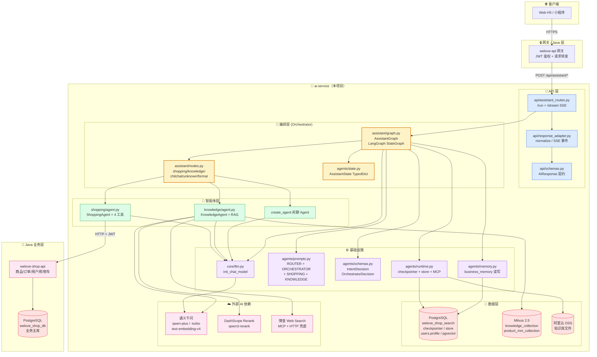
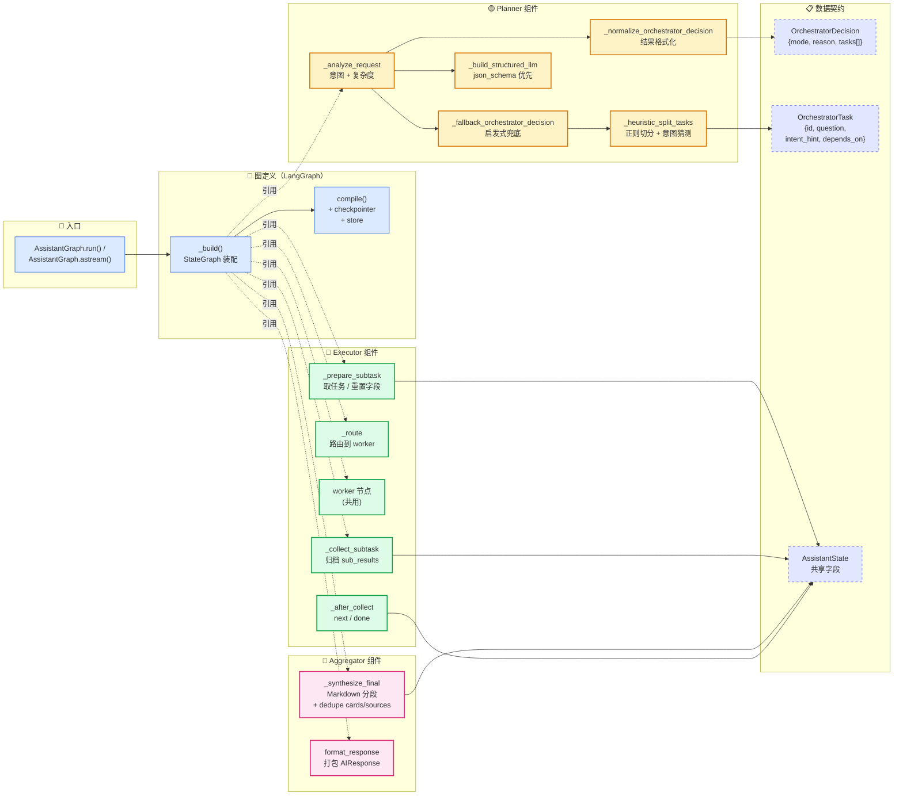
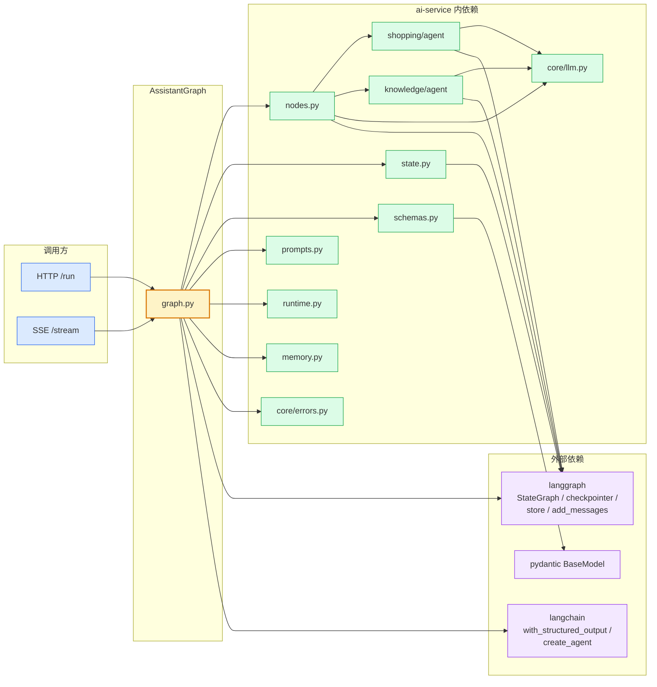
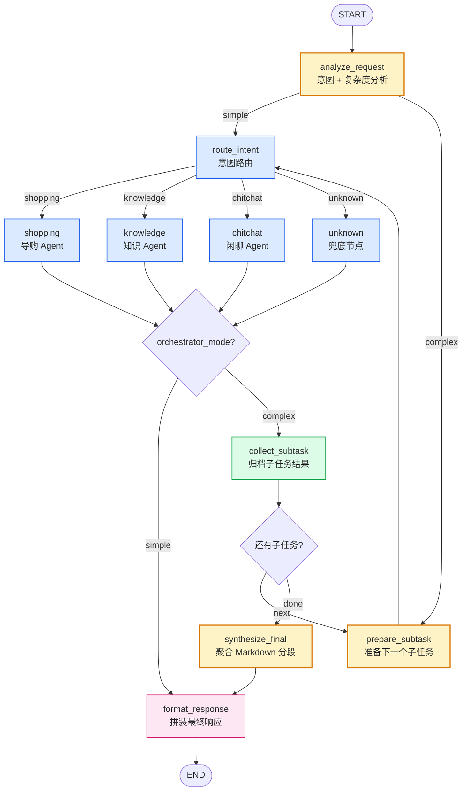
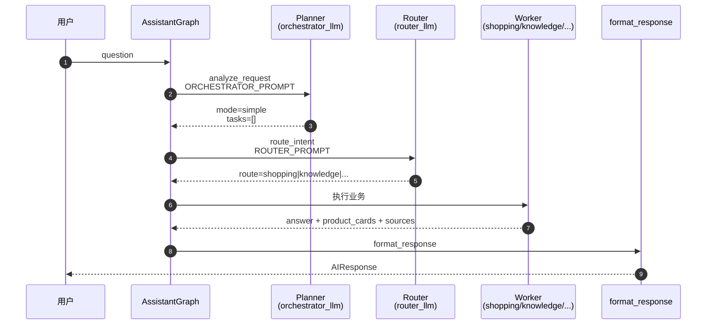
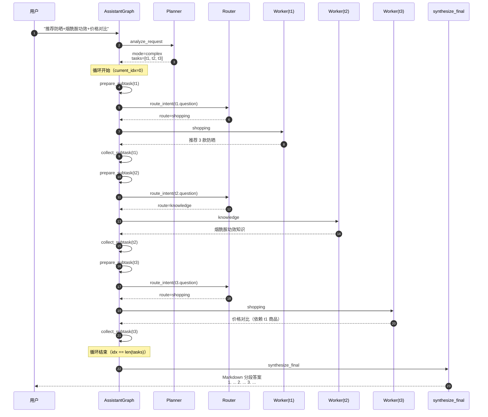
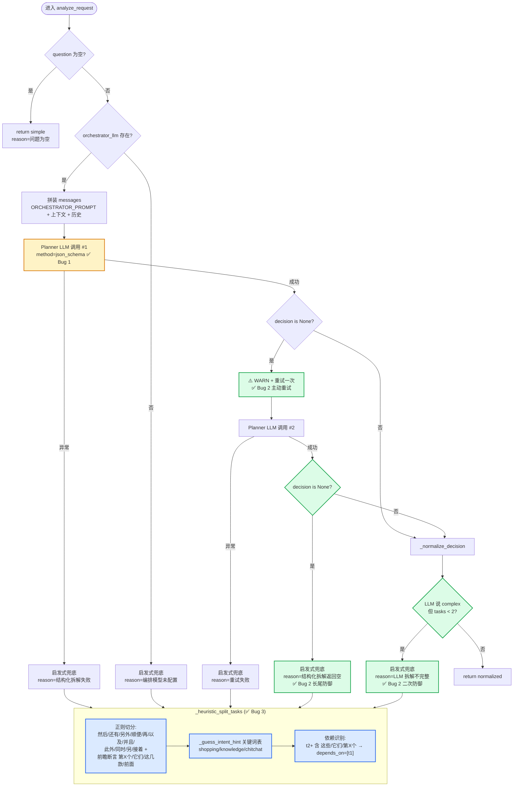
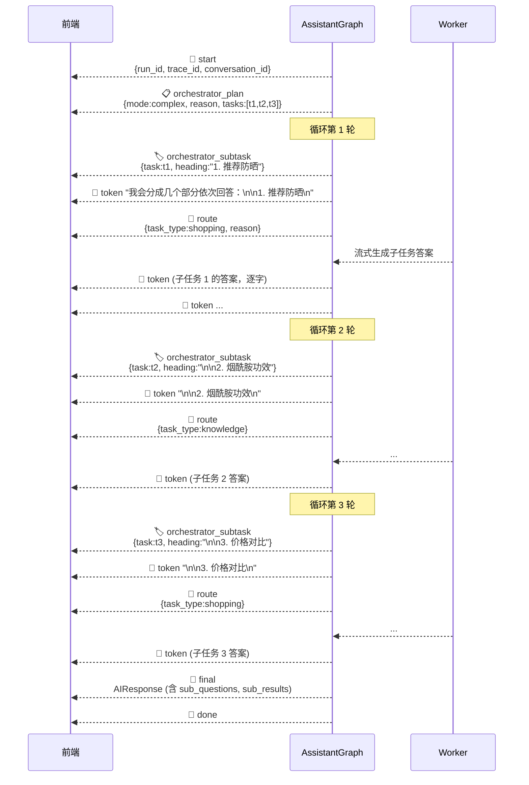

# AI-Service 主图流程图 + 架构图（Orchestrator 版）

> 本文档配套 `commit 12d8350`（主图接入 Orchestrator 多问题拆解），描述当前 `AssistantGraph`
> 的**分层架构、图拓扑、State 流转、SSE 事件时序、四重反空返回防线**。
>
> 代码位置：[ai-service/assistant/graph.py](../ai-service/assistant/graph.py)
> 相关 Schema：[ai-service/agents/schemas.py](../ai-service/agents/schemas.py)
> Prompt：[ai-service/agents/prompts.py](../ai-service/agents/prompts.py) `ORCHESTRATOR_PROMPT`
> 状态：[ai-service/agents/state.py](../ai-service/agents/state.py) `AssistantState`
>
> 📌 **图分两类**：架构图（§0）描述模块分层与依赖，流程图（§1 起）描述运行时数据流。

---

## 零、系统架构图（分层视角）

### 0.1 整体分层



**分层职责**：

| 层 | 主要模块 | 职责 |
| --- | --- | --- |
| 📡 API 层 | `assistant_routes.py` / `schemas.py` / `response_adapter.py` | FastAPI 路由、请求/响应契约、SSE 事件格式化 |
| 🎯 编排层 | `assistant/graph.py` / `assistant/nodes.py` / `agents/state.py` | LangGraph 图定义、节点实现、共享 State |
| 🤖 智能体层 | `shopping/agent.py` / `knowledge/agent.py` | 具体 Agent 实现，含工具调用 & RAG |
| ⚙️ 基础设施 | `core/llm.py` / `agents/prompts.py` / `agents/runtime.py` / `agents/memory.py` | LLM 客户端、Prompt 模板、跨轮记忆 |
| 💾 数据层 | PG (`welove_shop_search`) / Milvus / OSS | ai-service 侧：短期记忆 (checkpointer)、长期记忆 (store)、用户画像 (users.profile)、向量检索、文件存储 |
| ☁️ 外部 AI | 通义千问 / DashScope Rerank / 博查 | LLM、Embedding、Rerank、Web 搜索兜底 |

---

### 0.2 Orchestrator 模块内部架构



**组件划分**：

| 组件 | 内部函数 | 职责 |
| --- | --- | --- |
| 🟡 **Planner** | `_analyze_request` + `_normalize` + `_fallback` + `_heuristic_split_tasks` + `_build_structured_llm` | 判断 simple/complex、生成任务 DAG、四重反空返回防线 |
| 🔄 **Executor** | `_prepare_subtask` + `_route` + worker 节点 + `_collect_subtask` + `_after_collect` | 串行执行子任务、共享 State、循环控制 |
| 🎁 **Aggregator** | `_synthesize_final` + `format_response` | 聚合 Markdown 答案、去重卡片/来源、打包最终响应 |
| 📋 **数据契约** | `OrchestratorDecision` + `OrchestratorTask` + `AssistantState` | 三层间数据流转的强类型契约 |

---

### 0.3 依赖关系一览



关键依赖：

- `graph.py` 是**唯一**同时依赖 `langgraph.StateGraph` 和所有编排层模块的枢纽
- worker 节点通过 `nodes.py` 接入，`shopping/agent.py` 和 `knowledge/agent.py` 本身**不感知** Orchestrator 存在（松耦合）
- `state.py` 的 `AssistantState` 是全图 State 契约，改字段前需确认所有节点都能兼容
- 外部只依赖 langgraph / langchain / pydantic 三大件，没有绑定其他编排框架

---

## 一、主图整体拓扑



**节点分组**：

| 分组 | 节点 | 职责 |
|-----|-----|-----|
| 🟡 Planner | `analyze_request` / `prepare_subtask` / `synthesize_final` | Orchestrator 编排逻辑 |
| 🔵 Worker | `route_intent` / `shopping` / `knowledge` / `chitchat` / `unknown` | 业务执行，simple / complex 共享 |
| 🟢 Loop | `collect_subtask` | 子任务收尾 + 循环控制 |
| 🩷 Terminal | `format_response` | 最终响应打包 |

---

## 二、两条路径对比

### 2.1 simple 路径（单意图 / 澄清补充 / 元问题）



**特征**：
- Planner 判断为 simple → 直接跳过所有 orchestrator 节点
- 与老版主图行为完全一致，无额外延迟（Planner 那次调用是 500-800ms 内的一次预判）

### 2.2 complex 路径（跨意图 / 依赖追问 / 多独立问题）



**关键点**：
- 子任务**串行执行**（Phase 1 简化实现，Phase 2 再看是否上 DAG 并行）
- 所有子任务共享主图 `checkpointer` + `messages`，t2/t3 能看到 t1 的 AIMessage 上下文
- t3 的 `depends_on=["t1"]` 让 route 有依据判断"这些商品"指代前面 t1 推荐的商品

---

## 三、State 流转（AssistantState）

```mermaid
flowchart LR
    subgraph 输入["🟦 输入字段"]
        question
        conversation_id
        user_id
        jwt_token
    end

    subgraph Planner产出["🟡 Planner 产出"]
        original_question
        orchestrator_mode
        orchestrator_reason
        sub_questions
        current_subquestion_index
    end

    subgraph 子任务运行["🟢 子任务运行时"]
        active_subtask
        subtask_heading
        answer
        product_cards
        sources
        tool_calls
    end

    subgraph 聚合["🩷 最终聚合"]
        sub_results
        result
    end

    输入 --> Planner产出
    Planner产出 -->|prepare_subtask| 子任务运行
    子任务运行 -->|collect_subtask| 聚合
    聚合 -->|synthesize_final| result
```



**字段用途索引**（见 `agents/state.py`）：

| 字段 | 写入节点 | 读取方 |
|-----|---------|-------|
| `original_question` | analyze_request | 后续 log / 兜底 |
| `orchestrator_mode` | analyze_request | `_after_analyze` 路由 / SSE / 前端 |
| `orchestrator_reason` | analyze_request | SSE / 前端展示分段理由 |
| `sub_questions` | analyze_request | prepare_subtask 取任务 / 前端展示 DAG |
| `current_subquestion_index` | analyze_request → collect_subtask | prepare_subtask 取下一个 / `_after_collect` |
| `active_subtask` | prepare_subtask | collect_subtask 归档时读回 |
| `subtask_heading` | prepare_subtask | SSE `orchestrator_subtask` + `token` 事件 |
| `answer / product_cards / sources / tool_calls` | worker 节点 | collect_subtask 归档到 sub_results |
| `sub_results` | collect_subtask（累加） | synthesize_final 聚合 |
| `result` | format_response | API `/run` 或 SSE `final` 事件 |

---

## 四、Planner 决策与四重反空返回防线

`_analyze_request` 内部执行流程，重点是 Bug 1/2/3 的修复落点：



**四重防线映射到代码**：

| 层 | 修复内容 | 代码位置 |
|---|---------|---------|
| 🟡 Bug 1 | `method="json_schema"` 主选，异常回退 `function_calling` | [graph.py `_build_structured_llm`](../ai-service/assistant/graph.py) |
| 🟢 Bug 2a | `decision is None` 主动重试一次 | `_analyze_request` 步骤 3 |
| 🟢 Bug 2b | 重试仍空 → 启发式兜底 + warning 日志 | `_analyze_request` 步骤 5 |
| 🟢 Bug 2c | LLM 声称 complex 但 tasks &lt; 2 → 启发式补救 | `_analyze_request` 步骤 7 |
| 🔵 Bug 3 | 启发式 pattern 补 `此外/同时/第X个` + 前瞻断言 | `_HEURISTIC_SPLIT_PATTERN` |

---

## 五、SSE 事件时序（complex 场景）

前端会依次收到以下事件（`assistant/graph.py::astream`）：



**事件类型完整清单**：

| type | 何时 emit | data 字段 | 前端用途 |
|-----|----------|----------|---------|
| `start` | 请求开始 | `run_id / trace_id / conversation_id` | 记录会话 |
| `orchestrator_plan` | analyze_request 判定 complex | `mode / reason / tasks[]` | 显示"分成 N 个部分" |
| `orchestrator_subtask` | 每次 prepare_subtask | `task{id,question,intent_hint,depends_on} / heading` | 分段标题条 / DAG 进度 |
| `token` | LLM 流式增量 | `content` | 打字机效果 |
| `route` | route_intent 完成 | `task_type / reason` | 显示当前子任务走哪个 Agent |
| `tool_call` | 工具被调用 | `tool_name / input` | 工具调用可视化 |
| `tool_result` | 工具返回 | `tool_name / output` | 同上 |
| `final` | format_response 结束 | 完整 `AIResponse` | 拿到最终结构化响应 |
| `done` | 流关闭 | `{}` | 前端关流 |
| `error` | 异常 | `error_code / message` | 错误提示 |

---

## 六、意图路由内部结构（route_intent 节点内部）

```mermaid
flowchart LR
    in([进入 route_intent]) --> get_q[取 question]
    get_q --> load_mem[读 business_memory<br/>last_product_cards<br/>last_focused_product<br/>last_knowledge_entities<br/>user_preferences]
    load_mem --> build[拼 messages:<br/>ROUTER_PROMPT SystemMessage +<br/>context SystemMessage +<br/>history]
    build --> call[router_llm.ainvoke<br/>with_structured_output IntentDecision]
    call -->|异常/None| unknown_out["return route=unknown"]
    call -->|正常| out["return route + route_reason"]

    classDef ctx fill:#f0f9ff,stroke:#0284c7
    class load_mem ctx
```

- ROUTER_PROMPT 内容参考 [prompts.py](../ai-service/agents/prompts.py) `ROUTER_PROMPT`
- 关键分类规则：指代词 + 上下文类型双维判断（"更便宜"→ shopping、"副作用"→ knowledge）
- 复合意图按第一个意图分类 —— 这层判断被 Orchestrator 覆盖了，用户的复合意图先被 analyze_request 拆完再进 route_intent

---

## 七、常见路径示例

### 7.1 单意图推荐

```
用户: "给我推荐一款适合油皮的防晒"
────────────────────────────────────
analyze_request → mode=simple
route_intent → shopping
shopping_node → 3 款防晒 + product_cards
format_response → AIResponse (task_type=shopping)
```

### 7.2 单意图多细节（正确不拆解）

```
用户: "烟酰胺是什么、怎么用、有什么注意事项？"
────────────────────────────────────
analyze_request → mode=simple ⭐ 判断这是同一意图，KnowledgeAgent 一次分点回答
route_intent → knowledge
knowledge_node → 分 3 点回答
format_response → AIResponse (task_type=knowledge)
```

### 7.3 跨意图 + 依赖（Orchestrator 典型场景）

```
用户: "推荐三款补水面霜，然后比较这些哪个更便宜，第二个含什么成分？"
────────────────────────────────────
analyze_request → mode=complex
  tasks = [
    { id: t1, q: "推荐三款补水面霜",     intent: shopping,  deps: []      },
    { id: t2, q: "比较这些哪个更便宜",   intent: shopping,  deps: [t1]    },
    { id: t3, q: "第二个含什么成分？",   intent: knowledge, deps: [t1]    },
  ]

prepare_subtask(t1) → route_intent → shopping → 推荐 → collect(t1)
prepare_subtask(t2) → route_intent → shopping → 对比 → collect(t2)
prepare_subtask(t3) → route_intent → knowledge → 成分 → collect(t3)
synthesize_final → Markdown "1. ... 2. ... 3. ..."
format_response → AIResponse (task_type=orchestrator)
```

### 7.4 LLM 空返回 → 启发式兜底（Bug 修复后的路径）

```
用户: 复合问题
────────────────────────────────────
analyze_request
  → LLM 调用返回 None
  → ⚠️ WARN "结构化拆解返回 None，重试一次"
  → 重试 LLM 调用
  → 若仍 None
    → ⚠️ WARN "结构化拆解重试后仍为空，尝试启发式拆解"
    → _heuristic_split_tasks(question) 拆出 N 个 task
    → 若 N ≥ 2  → mode=complex 进 Orchestrator
    → 若 N < 2  → mode=simple 走原路径
```

---

## 八、图表维护约定

- 修改主图拓扑（增删节点 / 改路由条件）时，必须同步更新 §1 的 `flowchart TD`
- 修改 State 字段时，必须同步更新 §3 的字段索引表
- 新增 SSE 事件类型时，必须同步更新 §5 的事件清单
- 修改 Planner 逻辑（比如未来接入并行 DAG scheduler）时，重画 §4 的决策流程图
- 图表默认用 Mermaid，GitHub / VSCode Markdown Preview / Obsidian 都能直接渲染

---

## 九、相关文档

- 测试基线：[orchestrator-test-data-and-results.md](./orchestrator-test-data-and-results.md)
- Bug 调查记录：[orchestrator-known-issues.md](./orchestrator-known-issues.md)
- Feature commit：`12d8350 feat(ai-service): 主图接入 Orchestrator 多问题拆解 + 反空返回四重防线`
- 反幻觉前置工作：`1a7b884 feat(ai-service): 知识问答接入博查兜底 + 反幻觉四层防线`
